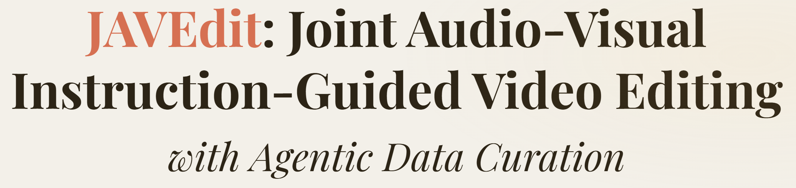
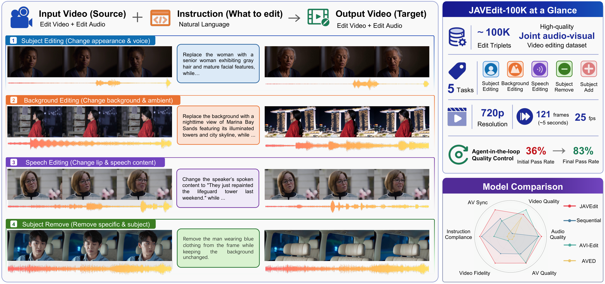
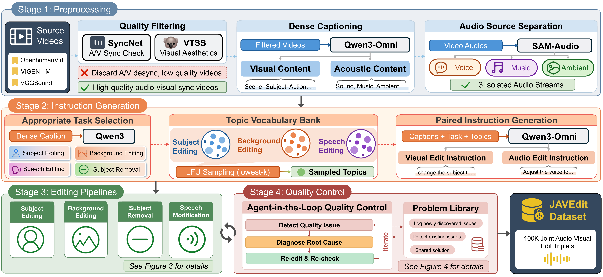
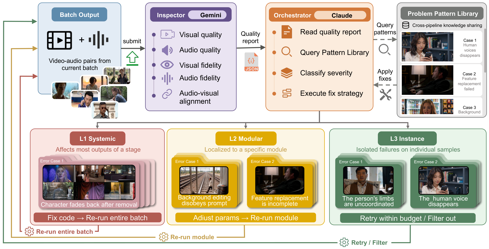
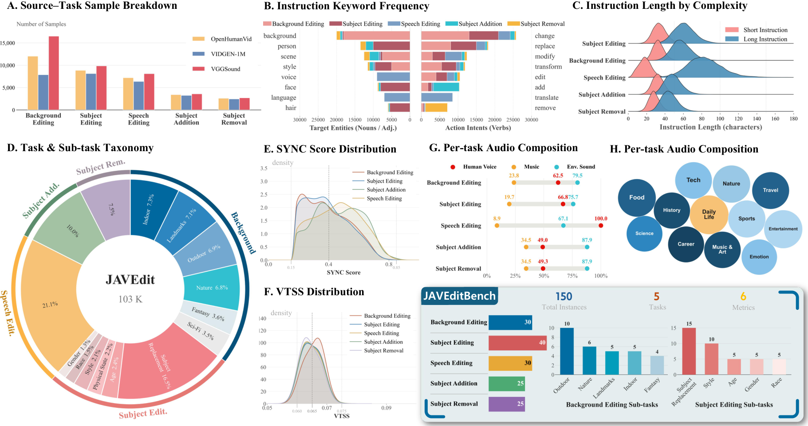
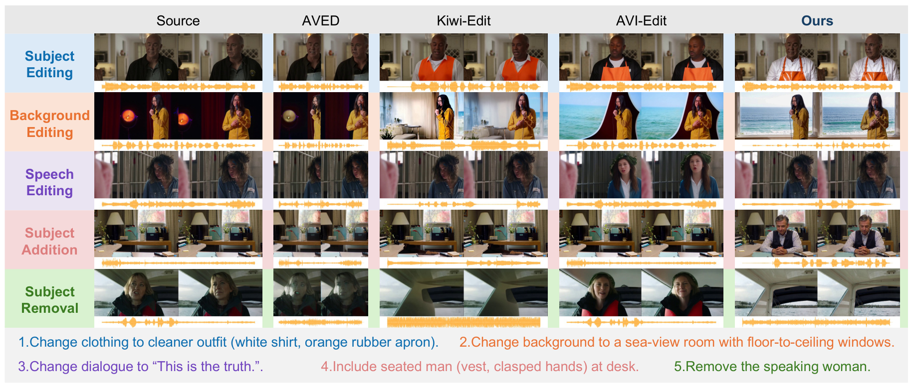

<p align="center">
    <a href="">

     </a>
</p>

<p align="center">
    <a href="https://scholar.google.com.hk/citations?user=-WKfgd0AAAAJ&hl=zh-CN"><strong>Yinan Chen <sup>1★</sup></strong></a>
    ·
    <a href=""><strong>Chuming Lin <sup>2★</sup></strong></a>
    ·
    <a href=""><strong>Zhennan Chen <sup>3</sup></strong></a>
    ·
    <a href=""><strong>Yuxiang Zeng <sup>4</sup></strong></a>
    ·
    <a href=""><strong>Junwei Zhu <sup>2</sup></strong></a>
    ·
    <br>
    <a href=""><strong>Yali Bi <sup>1</sup></strong></a>
    ·
    <a href=""><strong>Xijie Huang <sup>5</sup></strong></a>
    ·
    <a href=""><strong>Chengming Xu <sup>2</sup></strong></a>
    ·
    <a href=""><strong>Donghao Luo <sup>2</sup></strong></a>
    ·
    <a href="https://scholar.google.com/citations?hl=zh-CN&user=m3KDreEAAAAJ"><strong>Zhucun Xue <sup>1</sup></strong></a>
    ·
    <br>
    <a href="https://huuxiaobin.github.io/"><strong>Xiaobin Hu <sup>6</sup></strong></a>
    ·
    <a href="https://scholar.google.com/citations?user=fqte5H4AAAAJ"><strong>Chengjie Wang <sup>2</sup></strong></a>
    ·
    <a href="https://scholar.google.com/citations?user=qYcgBbEAAAAJ"><strong>Yong Liu <sup>1</sup></strong></a>
    ·
    <a href="https://zhangzjn.github.io/"><strong>Jiangning Zhang <sup>1,2</sup></strong></a><a href="mailto:186368@zju.edu.cn"><sup>📧</sup></a>
    ·
    <a href="https://yanshuicheng.info/"><strong>Shuicheng Yan <sup>6</sup></strong></a>
</p>
<p align="center">
    <strong><sup>1</sup>Zhejiang University</strong> &nbsp;&nbsp;&nbsp;
    <strong><sup>2</sup>YouTu Lab, Tencent</strong> &nbsp;&nbsp;&nbsp;
    <strong><sup>3</sup>Nanjing University</strong>
    <br>
    <strong><sup>4</sup>University of Auckland</strong> &nbsp;&nbsp;&nbsp;
    <strong><sup>5</sup>Fudan University</strong> &nbsp;&nbsp;&nbsp;
    <strong><sup>6</sup>National University of Singapore</strong>
</p>
<p align="center">
    <a href='https://github.com/RyanChenYN/JAVEdit'>
      
    </a>
    <a href="https://huggingface.co/datasets/Coraxor/JAVEdit-100k">
      
    </a>
    <a href="">
      
    </a>
    <a href='https://ryanchenyn.github.io/projects/JAVEdit'>
      
    </a>
    <a href='https://github.com/RyanChenYN/JAVEdit'>
      
    </a>
</p>

<a name="introduction"></a>

# :blush: Continuous Updates

This repository is the official implementation of **JAVEdit: Joint Audio-Visual Instruction-Guided Video Editing with Agentic Data Curation**. It collects the dataset, model, and benchmark resources for instruction-guided **joint audio-visual** video editing. If you find any work missing or have any suggestions, feel free to open a pull request or [contact us](#contact).

**🔥 More up-to-date joint audio-visual editing resources and evaluation results will continue to be updated.**

**📝 Update:**

- **[2026-05-29]** The JAVEdit paper is currently **under review**. 🚀
- **[2026-05-29]** Initial release of **JAVEdit-100k**, **JAVEditBench**, and the **JAVEdit** baseline. 🎉🎉🎉

<a name="highlight"></a>

# ✨ Highlight!!!



While instruction-based video editing has made significant progress, **joint audio-visual editing** remains constrained by the absence of dedicated datasets and benchmarks. We bridge this gap with three tightly-coupled contributions:

1. **JAVEdit-100k — the first large-scale joint audio-visual editing dataset:** ~103K high-quality, human-centric editing triplets across <em>five categories</em> (Subject Editing, Background Editing, Subject Removal, Subject Addition, Speech Editing), all at 1280×720, 121 frames, 25 FPS, paired with free-form natural-language instructions.
2. **Agent-in-the-loop quality control:** a scalable, fully automated curation mechanism (Inspector + Orchestrator agents with a shared Problem Pattern Library) that detects failures, diagnoses root causes, and repairs the pipeline — raising the qualification rate from <em>36% to 83%</em> without manual bottlenecks.
3. **JAVEditBench — a human-aligned benchmark:** 150 curated source videos with manually reviewed instructions, evaluated by <em>six metrics across five dimensions</em> that jointly assess visual–audio quality, instruction compliance, and video fidelity (Spearman's ρ ≥ 0.80 with human preference).
4. **JAVEdit — a strong baseline:** obtained by fine-tuning LTX-2.3 with LoRA on JAVEdit-100k, outperforming all baselines on <em>five of six</em> JAVEditBench metrics, with a <em>26% relative gain</em> in audio-visual synchrony over the strongest sequential alternative.

# :mailbox_with_mail: Summary of Contents

- [Introduction](#introduction)
- [Highlight](#highlight)
- [Data Pipeline](#movie_camera-data-pipeline)
- [Benchmark Statistics](#sunflower-benchmark-statistics)
- [Installation](#hammer-installation)
  - [Install requirements](#1-install-requirements)
  - [Download pretrained checkpoints](#2-download-pretrained-checkpoints)
  - [Download JAVEdit-100k dataset](#3-download-the-javedit-100k-dataset)
- [Usage](#muscle-usage)
  - [Generate target videos](#1-generate-target-videos)
  - [Run JAVEditBench evaluation](#2-run-javeditbench-evaluation)
- [Experiments](#bar_chart-experiments)
- [Citation](#black_nib-citation)
- [Contact](#contact)

<a name="pipeline"></a>

# :movie_camera: Data Pipeline



**Data construction pipeline of JAVEdit-100k.** Source videos from OpenHumanVid, VIDGEN-1M, and VGGSound undergo four stages: **(1) Preprocessing** — basic quality filtering (SyncNet A/V-sync + Koala-36M VTSS aesthetics), dense captioning (Qwen3-Omni), and audio source separation (SAM-Audio) into disentangled voice / music / ambient streams; **(2) Instruction Generation** — task selection, balanced least-frequently-used topic sampling from a curated vocabulary bank, and paired visual + audio instruction generation (Qwen3-235B); **(3) Editing Pipelines** — four dedicated pipelines covering five categories; **(4) Agent-in-the-loop Quality Control** — closed-loop detect → diagnose → repair → re-check.

### Agent-in-the-loop Quality Control



An **Inspector** agent (Gemini) examines sampled outputs and produces structured quality reports, while an **Orchestrator** agent (Claude) classifies failures into three levels — **L1 Systemic**, **L2 Modular**, and **L3 Instance** — and applies targeted fixes. Verified solutions are stored in a **Problem Pattern Library** for cross-pipeline reuse, raising the overall qualification rate from **36% to 83%** over three rounds.

<a name="benchmark-statistics"></a>

# :sunflower: Benchmark Statistics



Statistical distributions of JAVEdit-100k and JAVEditBench. JAVEdit-100k is the only dataset that **jointly covers audio and visual editing with free-form natural-language instructions**:

| Dataset | Scale | Audio | Instruction | Agent Control | Resolution | Frame Count |
| :--- | :---: | :---: | :---: | :---: | :---: | :---: |
| InsViE-1M | ~1M | ✘ | ✔ | ✘ | 1024×576 | 25 |
| Señorita-2M | ~2M | ✘ | ✔ | ✘ | 1984×1280 | 100 |
| Ditto-1M | ~1M | ✘ | ✔ | ✘ | 1280×720 | 101 |
| OpenVE-3M | ~3M | ✘ | ✔ | ✘ | 1280×720 | 65–129 |
| AVI-Edit | ~73K | ✔ | ✘ | ✘ | 1280×720 | ~240 |
| **JAVEdit-100k (Ours)** | **~103K** | **✔** | **✔** | **✔** | **1280×720** | **121** |

<a name="installation"></a>

# :hammer: Installation

### 1. Install requirements

```bash
git clone git@github.com:RyanChenYN/JAVEdit.git
cd JAVEdit
conda create -n javeditbench python=3.12 -y
conda activate javeditbench
pip install -r requirements.txt
```

System dependencies:

- `ffmpeg` and `ffprobe` must be available on `PATH`.
- A CUDA driver compatible with **CUDA 12.8** is required for the tested PyTorch/vLLM stack.
- The MLLM-based metrics were tested with `vllm==0.11.1`; newer vLLM releases may require CUDA 13 and are not recommended for this setup.

### 2. Download pretrained checkpoints

All checkpoint locations are configured in `metrics/path.yml`. Download the following pretrained models and update the corresponding paths:

- [Qwen/Qwen3-Omni-30B-A3B-Thinking](https://huggingface.co/Qwen/Qwen3-Omni-30B-A3B-Thinking) — instruction compliance / video fidelity / AV-quality judge
- [Koala-36M/Training_Suitability_Assessment](https://huggingface.co/Koala-36M/Training_Suitability_Assessment) — VTSS visual quality
- [sarulab-speech/UTMOSv2](https://huggingface.co/sarulab-speech/UTMOSv2) — UTMOSv2 audio quality (`fold0_s42_best_model.pth`)
- SyncNet / LatentSync face-detection and lip-sync weights (`yoloface_v5l.pt`, `p1.pt`, `p2.pt`, `res101_maxpool_pts217.bin`)

After downloading, edit `metrics/path.yml` to point each entry to your local checkpoint directory. All paths are resolved relative to the location of `path.yml`.

### 3. Download the JAVEdit-100k dataset

The full training dataset and the JAVEditBench test set are hosted on Hugging Face:

```bash
huggingface-cli download --repo-type dataset --resume-download Coraxor/JAVEdit-100k --local-dir $YOUR_LOCAL_PATH
```

<a name="usage"></a>

# :muscle: Usage

### 1. Generate target videos

Run your own joint audio-visual editing model on the **JAVEditBench** source videos to produce edited (target) videos. Each edited video is matched to its source by the 32-character hash prefix in the filename, e.g.:

```text
0a16d2122d7b9e9fe6c2a6aa65b658e6.mp4                          # source
0a16d2122d7b9e9fe6c2a6aa65b658e6_0_edited_with_audio.mp4      # target
```

The benchmark CSV provides at least the following columns:

```text
video,task,prompt,detailed_prompt_cn
```

### 2. Run JAVEditBench evaluation

JAVEditBench provides a unified entry point for six metrics across five dimensions:

| Metric (`--metric`) | Dimension | Backbone |
| :--- | :--- | :--- |
| `vtss` | Visual Quality | Koala-36M VTSS |
| `utmos` | Audio Quality | UTMOSv2 |
| `syncnet` | Audio-Visual Synchrony | LatentSync SyncNet |
| `instruction_compliance` | Instruction Following | Qwen3-Omni |
| `video_fidelity` | Video Fidelity | Qwen3-Omni |
| `av_quality` | Holistic A/V Quality | Qwen3-Omni |

Run all metrics:

```bash
cd metrics

VLLM_WORKER_MULTIPROC_METHOD=spawn python evaluate.py \
    --video_dir /path/to/edited_videos \
    --bench_csv /path/to/benchmark.csv \
    --output_path /path/to/eval_results \
    --metric syncnet vtss utmos av_quality instruction_compliance video_fidelity \
    --num_gpus 8 \
    --name javedit_eval
```

Run only the lightweight (non-MLLM) metrics on a single GPU:

```bash
python evaluate.py \
    --video_dir /path/to/edited_videos \
    --bench_csv /path/to/benchmark.csv \
    --metric utmos \
    --num_gpus 1 \
    --name javedit_utmos
```

Each run writes a detailed `*_results.json` and a `*_summary.csv` to `--output_path`; runtime logs are written to `metrics/logs/`. Use `VLLM_WORKER_MULTIPROC_METHOD=spawn` whenever the Qwen3-Omni metrics are involved.

<a name="experiments"></a>

# :bar_chart: Experiments

### Quantitative Comparison

**Quantitative comparison on JAVEditBench across five evaluation dimensions.** JAVEdit ranks first on **five of six** metrics. Best results are **bolded**.

| Method | Visual Quality ↑ | Audio Quality ↑ | A/V Sync ↑ | Instruction Compliance ↑ | Video Fidelity ↑ | A/V Quality ↑ |
| :--- | :---: | :---: | :---: | :---: | :---: | :---: |
| AVED | 0.0590 | 1.72 | 0.1641 | 2.95 | 3.87 | 2.93 |
| AVI-Edit | **0.0604** | 2.34 | 0.2721 | 3.49 | 3.89 | 3.86 |
| Sequential | 0.0563 | 2.35 | 0.2925 | 3.99 | 4.08 | 3.51 |
| **JAVEdit (Ours)** | 0.0596 | **2.42** | **0.3688** | **4.07** | **4.22** | **3.88** |

Compared with the strongest **Sequential** cascade (Kiwi-Edit + HunyuanVideo-Foley), joint modeling yields a **26% relative gain** in audio-visual synchrony, validating the necessity of joint audio-visual modeling and agent-curated data.

### Qualitative Comparison



**Qualitative comparison on JAVEditBench.** Rows correspond to the five editing categories; columns show the source video and the outputs of each method. JAVEdit consistently generates edits that are visually coherent, semantically faithful to the instruction, and temporally synchronized across both modalities.

<a name="citation"></a>

# :black_nib: Citation

If you find **JAVEdit** useful for your research, please consider giving a star ⭐ and citation 📝 :)

```bibtex
@article{chen2026javedit,
  title={JAVEdit: Joint Audio-Visual Instruction-Guided Video Editing with Agentic Data Curation},
  author={Chen, Yinan and Lin, Chuming and Chen, Zhennan and Zeng, Yuxiang and Zhu, Junwei and Bi, Yali and Huang, Xijie and Xu, Chengming and Luo, Donghao and Xue, Zhucun and Hu, Xiaobin and Wang, Chengjie and Liu, Yong and Zhang, Jiangning and Yan, Shuicheng},
  journal={arXiv preprint arXiv:XXXX.XXXXX},
  year={2026}
}
```

<a name="contact"></a>

# ✉️ Contact

```
yinan.chen@zju.edu.cn
```

# :pray: Acknowledgements

JAVEdit is built upon and vendors components from many excellent open-source projects, including LTX-Video, Qwen3-Omni, Qwen3, Koala-36M, UTMOSv2, LatentSync, SAM-Audio, HunyuanImage-3.0, Wan2.2-Animate, HunyuanVideo-Foley, MiniMax-Remover, and SAM3. We sincerely thank the authors for their contributions to the community.
